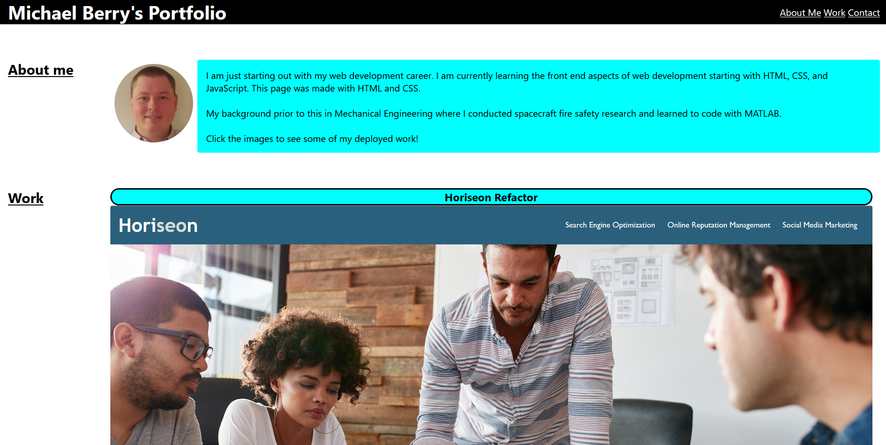

# <mb-portfolio>

## Description

This project created a portfolio to highlight previous work for potential employers.

The portfolio itself acts as an example of work by featuring functional navigational links, links to completed and deployed projects that can be accessed by clicking the images, and adaptive resizing of elements on different screen sizes.

This project highlighted responsive layout desgin that adapts to changing screen sizes via flexbox in css.

## Usage

A deployed version of the project can be found at https://mgberrysd.github.io/mb-portfolio/

When loaded the page should appear as

## Credits

The portfolio, including the html index and css sytyle sheet, was created by Michael Berry.